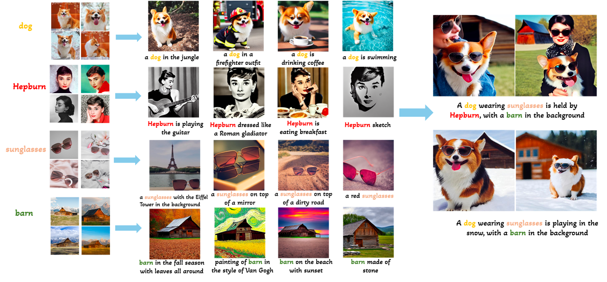

# Infusion
Infusion: Preventing Customized Text-to-Image Diffusion from Overfitting

**[[Project Page]](https://zwl666666.github.io/infusion/)** | **[[Paper]](https://arxiv.org/abs/2404.14007)**
**Abstract:** Text-to-image (T2I) customization aims to create images that embody specific visual concepts delineated in textual descriptions
However, existing works still face a main challenge, concept overfitting. To tackle this challenge, we first analyze overfitting, categorizing it into concept-agnostic overfitting, which undermines non-customized concept knowledge, and concept-specific overfitting, which is confined to customize on limited modalities, i.e, backgrounds, layouts, styles. To evaluate the overfitting degree, we further introduce two metrics, i.e, Latent Fisher divergence and Wasserstein metric to measure the distribution changes of non-customized and customized concept respectively.
Drawing from the analysis, we propose Infusion, a T2I customization method that enables the learning of target concepts to avoid being constrained by limited training modalities, while preserving non-customized knowledge. Remarkably, Infusion achieves this feat with remarkable efficiency, requiring a mere 11KB of trained parameters. Extensive experiments also demonstrate that our approach outperforms state-of-the-art methods in both single and multi-concept customized generation. <br>

### ⏳ To do
- [ ] Customized training
- [ ] Single concepts inference
- [ ] Multi concepts inference
- [ ] overfitting metrics
- [ ] Support SDXL-1.0

## Environment
Create and activate the conda environment:

```
conda env create -f environment.yaml
conda activate infusion
```
## Training
Download the [SD V1.5](https://huggingface.co/runwayml/stable-diffusion-v1-5/resolve/main/v1-5-pruned-emaonly.ckpt) or [SD V2.1](https://huggingface.co/stabilityai/stable-diffusion-2-1-base/resolve/main/v2-1_512-ema-pruned.ckpt) to `./ckpt/`.

Then run the commands:

```
python main.py \
    --name teddy \
    --base ./configs/infusion_cat.yaml \
    --basedir ./ckpt \
    -t True \
    --gpus 0,
```
To prepare your own training data, please ensure that they are placed in a folder `/path/to/your/images/`.
You need to download pretrained weight of [clipseg](https://github.com/timojl/clipseg):
```
wget https://owncloud.gwdg.de/index.php/s/ioHbRzFx6th32hn/download -O ./clipseg/weights.zip
unzip -d ./clipseg/weights -j ./clipseg/weights.zip
```
Then run:
```
python ./data/soft_segment.py --image_dir /path/to/your/images/ --super_class your_own_super_class
```
Modify the `initializer_words`, `data_root`, `flip_p` in `./configs/infusion_custom.yaml` or `./configs/infusion_custom_sd_v2.yaml`.

Finally, run:
```
python main.py \
    --name experiment_name \
    --base ./configs/infusion_custom.yaml \
    --basedir ./ckpt \
    -t True \
    --gpus 0,
```
You can find weights along with tensorboard in `./ckpt`.
## Generating
Personalized samples can be obtained by running the command
```
python scripts/infusion_txt2img.py --ddim_eta 0.0 \
                                    --steps 50  \
                                    --scale 6.0 \
                                    --beta 0.7 \
                                    --tau 0.15 \
                                    --n_samples 4 \
                                    --n_iter 1 \
                                    --personalized_ckpt ./ckpt/cat.ckpt \
                                    --prompt "photo of a {}"
```
## Citation

If you find this work useful for your research, please consider citing our paper:

```bibtex
@article{zeng2024infusion,
  title={Infusion: Preventing Customized Text-to-Image Diffusion from Overfitting},
  author={Zeng, Weili and Yan, Yichao and Zhu, Qi and Chen, Zhuo and Chu, Pengzhi and Zhao, Weiming and Yang, Xiaokang},
  journal={arXiv preprint arXiv:2404.14007},
  year={2024}
}
```
## Acknowledgement

This repo benefits from [Custom Diffusion](https://github.com/adobe-research/custom-diffusion), [Perfusion](https://github.com/ChenDarYen/Key-Locked-Rank-One-Editing-for-Text-to-Image-Personalization) Thanks for their wonderful works.
